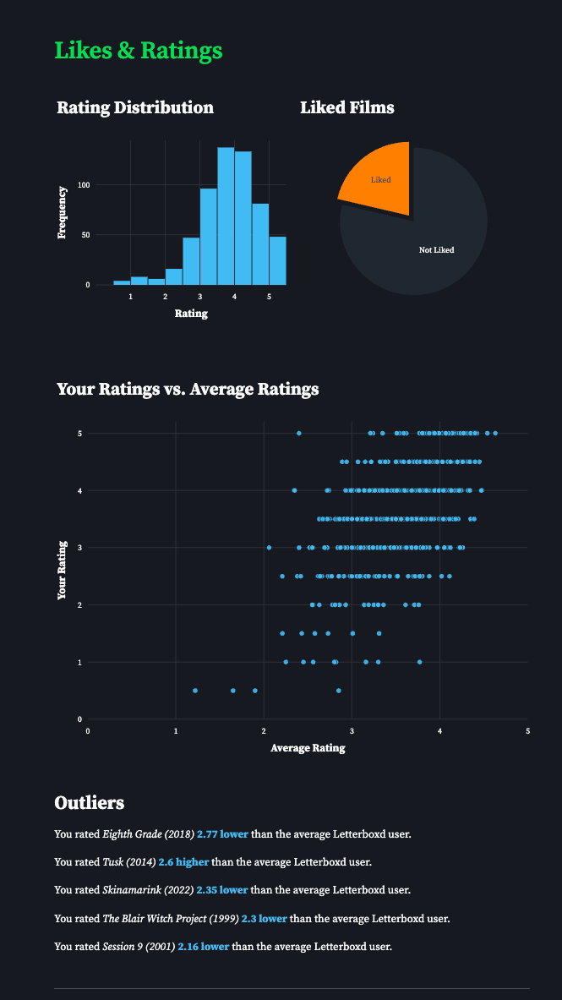
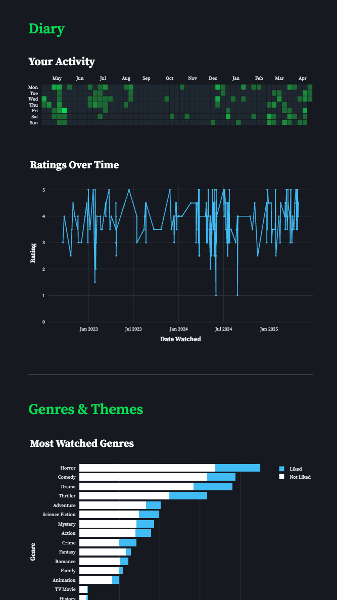
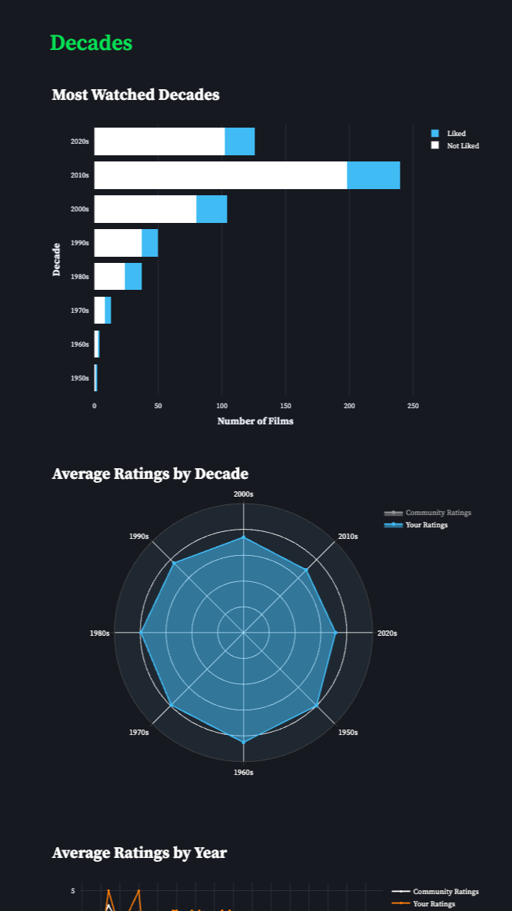

# 🍿 Boxd Office

Visualize your Letterboxd profile data with interactive charts and insights!

  

## How It Works

1. Enter your Letterboxd username
2. The app scrapes your public profile data (this may take a few minutes)
3. Explore interactive visualizations across multiple categories!

| Category | Visualizations |
|----------|----------------|
| **Likes & Ratings** | Histogram • Pie chart • Scatter plot |
| **Diary Activity** | Calendar heatmap • Line chart |
| **Genres & Themes** | Bar graphs • Radar chart |
| **Decades** | Distribution • Radar chart • Yearly trends |
| **Obscurity Metrics** | Histograms |
| **Runtime Analysis** | Histogram |
| **People & Studios** | Bar charts • Radar charts |
| **Languages & Countries** | Bar chart • World map heatmap |

## Installation & Usage

### Option 1: Use the Live Web App
Visit [boxdoffice.streamlit.app](https://boxdoffice.streamlit.app)

### Option 2: Run Locally
1. Clone the repository:
   ```bash
   git clone https://github.com/rubylu-05/boxd-office.git
   cd boxd-office
   ```
2. Install the dependencies:
   ```bash
   pip install -r requirements.txt
   ```
1. Run the app!
   ```bash
   streamlit run app.py
   ```

## Data Privacy

- The app only accesses the **public** Letterboxd data on your profile
- No data is stored or logged
- All processing happens in your browser


## Tech Stack
**Backend**:  
Python • Pandas • BeautifulSoup 

**Frontend & Visualizations**:  
Streamlit • Plotly • CSS

***
Thanks for reading :)
